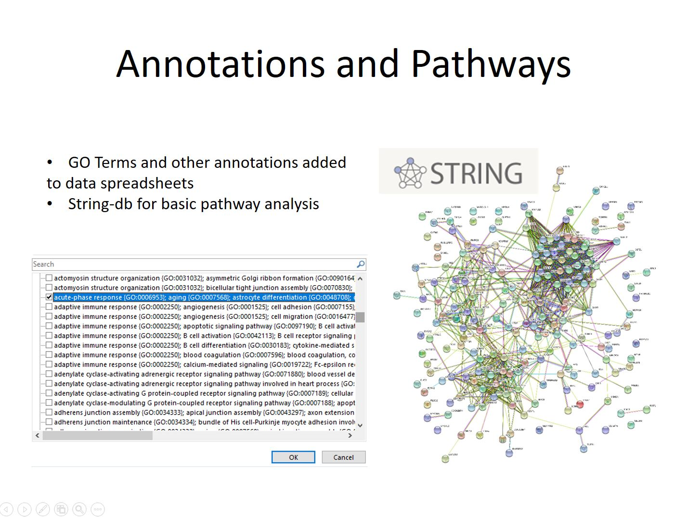

# Data_Analysis_Overview

An overview of common data analysis methods used by PSR.

---

### Author: John Klimek
### Date: Sept. 29th, 2020
### OHSU Proteomics Shared Resource

***

_Slide 1_

Proteomics data analysis encompasses a wide variety of techniques. Depending on what question you are trying to answer the analysis used can be very different. The Proteomics Shared Resource uses a variety of commercial and open-source tools, some of which were developed here at OHSU.

***

_Slide 2_

Determination of the mass of an intact protein is one of the simplest analyses we perform, and easiest to learn. It is commonly done by researchers outside of PSR using instruments and software in the shared resource.

A shotgun experiment got its name because of the large number of proteins that are sprayed into the mass spectrometer all at once. In contrast to a whole mass experiment which usually just has a single protein. The proteins in a shotgun experiment will be digested into smaller peptides using enzymes like Trypsin, and pieces that are seen are then used to reconstruct the proteins that are present.

***

_Slide 3_

Quantitative experiments require more care and planning than simpler identification experiments in order to obtain good quantitative information. These experiments can range from simpler screens where we count the number of matched spectra to proteins in a couple of samples, to larger projects involving isotopic labels and many dozen of samples normalized across multiple LC-MS runs.

Targeted analysis of peptides/proteins is used to test specific hypotheses for a subset of proteins in contrast to shotgun proteomics where thousands of proteins are quantified without prior knowledge. Targeted analysis experiments can be extremely sensitive, but require prior knowledge of which peptides and ions are present in the sample. Because of this they are often done as follow-up to shotgun experiments.

***

_Slide 4_

When measuring the mass of an intact protein an infusion or rapid LC gradient is used to deliver the protein into the mass spectrometer. Multiple scans will usually be averaged to create a composite MS1 spectra. The peak series in this spectra will then be deconvoluted using software that comes with out instruments to determine the mass of the protein. It is also possible to determine if there are multiple forms of a protein present, perhaps as a results of a post-translational modification or truncation. However because each protein, or protein form, will create dozens of peaks it’s important to keep the sample simple or the deconvolution software won’t be able to reconstruct the mass correctly. Samples usually consist of only a single well-purified protein in high abundance.

***

_Slide 5_

During a shotgun peptide identification experiment peptides elute from a Liquid Chromatography column over a period of minutes to hours, depending on the expected complexity of the sample. As peptide ions elute they are detected, trapped, and fragmented. The fragmentation step causes breaks along the amino acid chain at random locations. The result is a series of ions that have masses depending where along the chain the break occurred. The gaps between the ions in the series can be compared to the theoretical masses from amino acid sequences in a species’ protein .fasta database to identify the amino acids present.

***

_Slide 6_

Additional sequences are added to the FASTA database as quality controls. These come in two types contaminate sequences and the revered sequences of the proteins from the species being investigated. The contaminate entries consistent of commonly seen proteins such as human keratin, digestion enzymes, and QC standards used on the mass spectrometer. These sequences are flagged so they are not mistaken for proteins that come from the sample.

The reversed sequences are used to estimate false discovery rates. Nearly every peak detected by the mass spectrometer gets fragmented and a best match sequence assigned to it. Unfortunately there are a large number background ions entering the mass spectrometer along with the peptides which must be filtered out. Each fragmentation match gets a discriminate score calculated for it based on a number of factors. Spectra that are matched incorrectly will score lower and at equal frequency to the normal and reversed sequences in the database. Because of this they can be used to estimate the error rate at different score thresholds, and data can be filtered at score values that give the desired false discovery rate.

Peptide identifications passing the score threshold are used to infer the proteins present in the same using an Occam's razor approach which tries to explain all the peptides present with the shortest list of proteins possible. The resulting protein list is finally spit out into a spreadsheet along with information about scores, probabilities, and numbers of matching spectra.

Most of these experiments at PSR are done using the open source Comet software along with the PAW Pipeline which was developed at OHSU. However other tools such as Sequest + Proteome Discoverer, Andromeda + Max Quant, and Byonic may be used depending on the requirements of the experiment.

***

_Slide 7_

Some rough quantitative comparisons are done by manually comparing spectral count numbers between samples and looking for large differences. We also use an intensity-based sliding-window Z-Score test to do simpler compassions with in-house python scripts.

However most true quantitative experiments require more depth and precision. For these kinds of experiments samples are labelled with isotopic tagging reagents (TMT) with a unique mass and mixed together to eliminate variability coming the instrument. The relative amount of each tag can be measured and gives a far more precise relative measurement of peptide or protein amount. Statistical analysis is primarily done using R packages from Bioconductor and Jupyter Notebooks to communicate the results to clients and journals. Spreadsheets containing the details and lists of candidates are also provided.

***

_Slide 8_

Quantitative data from these experiments is run through a series of filters before processing. These filters help to control the error rate of the identifications and remove sparse and low quality reporter ion values. The data is then run through one or more normalization routines. TMM normalization is used on data within a single LC-MS run, and IRS Normalization is done between pooled channels when tying together data from multiple runs on the instrument.

***

_Slide 9_

Once the data has been prepped statistical analysis can be performed. The most commonly used tool is the exact test within edgeR, though various other tests may be done depending on the nature of the data. Multiple testing corrections are applied to the p-values to limit the candidate false discovery rate, and fold-change criteria may also be invoked if necessary.

The Jupyter Notebook generated during data analysis will contain the code used, along with notes and annotation to aid in reproducing the experiment. Quality control checks including p-value histograms, CV distributions, and scatterplots comparing individual samples will also be included with explanations to help put the results in context of what we usually see during these experiments. Values for all the proteins is finally exported into an excel spreadsheet where data is further annotation and labelled to highlight important information such as differential candidates and lower quality data points.

***

_Slide 10_

The final step in some experiments involves adding annotations and investigating interaction pathways. In-house scripts are used to query online database and download annotation information such as GO-Terms and add it to the results spreadsheet. This allows for easy filtering for proteins with different terms. The STRING tool at string-db.org is used to do simple pathway analysis. Often times a list of candidates identified in a quantitative experiment will be run through the tool, and lists of enriched Go-Terms along with know interactions passed along with the results spreadsheet and Jupyter Notebook.

***

_Slide 11_

If the proteins and peptides that need to be studied are know it’s often possible to do a targeted analysis. These experiment often require an initial shotgun run prior to identify good candidate ions for targeted analysis. Once the initial experiment is complete the list of ions can be used to focus the mass spectrometer’s time using an inclusion list or SRM/MRM experiment. These types of experiment allow of detection and quantitation of the ion at lower levels than would be possible with traditional experiments. Open source Skyline from University of Washington is used for targeted proteomics followed by other software.

***

Thank you!
